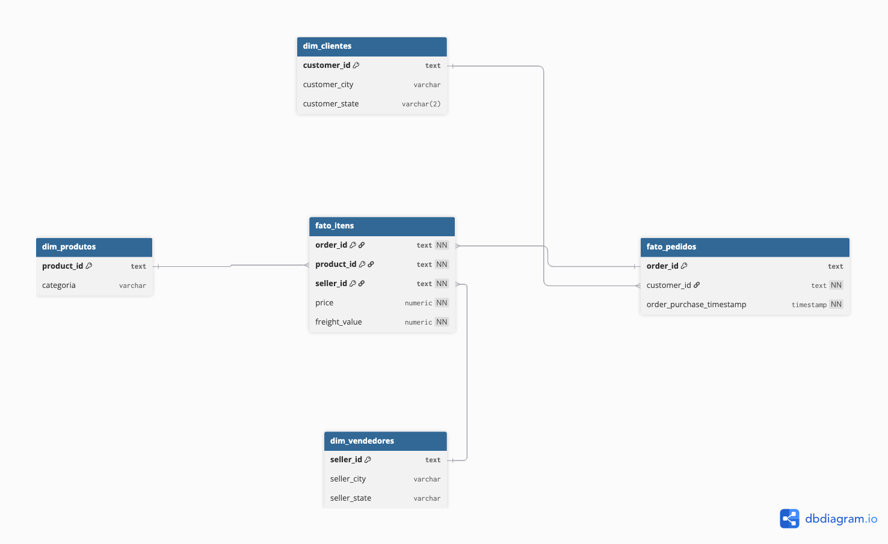

# 🗄️ Olist Sales Analytics — Modelagem Dimensional PostgreSQL

Banco de dados analítico aplicando **Star Schema** sobre dataset real de e-commerce brasileiro (Olist/Kaggle). Projeto desenvolvido para demonstrar modelagem dimensional, integridade referencial e SQL analítico avançado.

[](https://www.postgresql.org/)
[](https://www.kimballgroup.com/)
[](https://opensource.org/licenses/MIT)

---

## 📊 Visão Geral

**Objetivo:** Criar estrutura analítica para responder perguntas de negócio sobre vendas, produtos, clientes e vendedores em um marketplace brasileiro.

**Dataset:** [Brazilian E-Commerce Public Dataset by Olist](https://www.kaggle.com/datasets/olistbr/brazilian-ecommerce)  
**Período:** 2016-2018 | **Volume:** ~100.000 pedidos | **Linhas carregadas:** 98.778 em `fato_itens`  
**Tecnologia:** PostgreSQL 15 | **Modelagem:** Star Schema

---

## 🗄️ Modelo de Dados



### Arquitetura: Star Schema

#### 📂 Dimensões (3FN)

- **`dim_clientes`** — Dados cadastrais de clientes (customer_id, cidade, estado)
- **`dim_produtos`** — Catálogo de produtos por categoria
- **`dim_vendedores`** — Informações de sellers (seller_id, localização)

#### 📊 Fatos (Desnormalizadas para OLAP)

- **`fato_pedidos`** — Transações de pedidos (granularidade: 1 pedido)
- **`fato_itens`** — Itens vendidos (granularidade: 1 produto × 1 pedido × 1 vendedor)

### 🔑 Decisões Técnicas

✅ **Integridade referencial:** 4 Foreign Keys com políticas `CASCADE/RESTRICT`  
✅ **Performance:** 15 índices estratégicos (FKs, campos temporais, geográficos)  
✅ **Qualidade de dados:** 240 duplicatas removidas antes de criar PK composta em `fato_itens`  
✅ **Otimização temporal:** Índice funcional em `DATE_TRUNC('month', order_purchase_timestamp)`

**Documentação completa:**

- [📋 Dicionário de Dados](docs/dicionario-dados.md)
- [📐 Normalização e Trade-offs](docs/normalizacao.md)

---

## 🚀 Como Reproduzir

### Pré-requisitos

- PostgreSQL 15 ou superior
- DBeaver, pgAdmin ou psql
- Dataset Olist ([download aqui](https://www.kaggle.com/datasets/olistbr/brazilian-ecommerce))

### 1. Clonar repositório

```bash
git clone https://github.com/rodrigodesouza7/ecommerce-olist-analytics.git
cd ecommerce-olist-analytics
```

### 2. Baixar dataset

- Acesse: https://www.kaggle.com/datasets/olistbr/brazilian-ecommerce
- Baixe e extraia os CSVs na pasta `dados/` (já gitignored)

### 3. Criar banco de dados

```sql
CREATE DATABASE olist_analytics;
```

### 4. Executar scripts DDL (ordem importa)

```bash
psql -d olist_analytics -f sql/ddl/01_create_dim_clientes.sql
psql -d olist_analytics -f sql/ddl/02_create_dim_produtos.sql
psql -d olist_analytics -f sql/ddl/03_create_dim_vendedores.sql
psql -d olist_analytics -f sql/ddl/04_create_fato_pedidos.sql
psql -d olist_analytics -f sql/ddl/05_create_fato_itens.sql
psql -d olist_analytics -f sql/ddl/06_create_constraints.sql  # Crítico: FKs + limpeza de duplicatas
psql -d olist_analytics -f sql/ddl/07_create_indexes.sql
```

### 5. Carregar dados

Use DBeaver (Import Data) ou COPY via psql:

```sql
-- Ajustar paths conforme localização dos CSVs
\COPY dim_clientes FROM 'dados/olist_customers_dataset.csv' CSV HEADER;
\COPY dim_produtos FROM 'dados/olist_products_dataset.csv' CSV HEADER;
\COPY dim_vendedores FROM 'dados/olist_sellers_dataset.csv' CSV HEADER;
\COPY fato_pedidos FROM 'dados/olist_orders_dataset.csv' CSV HEADER;
\COPY fato_itens FROM 'dados/olist_order_items_dataset.csv' CSV HEADER;
```

---

## 📈 Queries Analíticas Implementadas

### 1️⃣ Evolução da Receita Mensal com Crescimento (KPI Executivo)


**Problema de negócio:** CEO precisa monitorar crescimento mensal para identificar tendências e sazonalidades.

**Técnicas SQL:** `DATE_TRUNC`, `LAG()` (window function), cálculo percentual de crescimento

```sql
-- Ver query completa em: sql/queries/q01_receita_mensal_crescimento.sql
```

**Insight:** Crescimento de 23% entre nov/2017 e dez/2017 (Black Friday + Natal)

---

### 2️⃣ Top Produtos por Categoria (Ranking)


**Problema de negócio:** Gerente de produto quer saber quais itens investir em estoque prioritário.

**Técnicas SQL:** `RANK() OVER PARTITION BY`, agregações por categoria

```sql
-- Ver query completa em: sql/queries/q02_top_produtos_por_categoria.sql
```

**Insight:** Categoria "eletrônicos" concentra 3 dos 5 produtos mais lucrativos (alto ticket, alto giro)

---

### 3️⃣ Análise Geográfica de Vendas


**Problema de negócio:** Diretor comercial quer identificar regiões com maior potencial para abertura de centros de distribuição.

**Técnicas SQL:** Agregação geográfica, percentual do total via window function

```sql
-- Ver query completa em: sql/queries/q03_analise_geografica_vendas.sql
```

**Insight:** SP concentra 41.8% da receita nacional, mas ticket médio no DF é 15% superior

---

### 4️⃣ Performance de Vendedores (Top 20 Sellers)

**Problema de negócio:** Marketplace precisa identificar top sellers para programas de incentivo.

```sql
-- Ver query completa em: sql/queries/q04_performance_vendedores.sql
```

---

### 5️⃣ Análise de Custo de Frete por Categoria

**Problema de negócio:** CFO quer reduzir custos operacionais identificando categorias com frete desproporcional.

```sql
-- Ver query completa em: sql/queries/q05_analise_custo_frete.sql
```

**Insight:** Categoria "móveis" tem frete médio 38% do valor do produto (oportunidade de renegociação logística)

---

## 🛠️ Stack Técnica

- **Banco de dados:** PostgreSQL 15
- **Modelagem:** Star Schema (Kimball)
- **SQL:** DDL, Constraints (PKs/FKs), Índices, Window Functions, CTEs, Agregações
- **Ferramentas:** DBeaver, VS Code, dbdiagram.io
- **Versionamento:** Git/GitHub

---

## 📂 Estrutura do Projeto

ecommerce-olist-analytics/
├── dados/
│ └── \*.csv (gitignored)
├── docs/
│ ├── modelo-conceitual.png
│ ├── dicionario-dados.md
│ ├── normalizacao.md
│ ├── print1_receita_mensal_crescimento.png
│ ├── print2_top_produtos_ranking.png
│ └── print3_analise_geografica.png
├── sql/
│ ├── ddl/
│ │ ├── 01_create_dim_clientes.sql
│ │ ├── 02_create_dim_produtos.sql
│ │ ├── 03_create_dim_vendedores.sql
│ │ ├── 04_create_fato_pedidos.sql
│ │ ├── 05_create_fato_itens.sql
│ │ ├── 06_create_constraints.sql
│ │ └── 07_create_indexes.sql
│ ├── queries/
│ │ ├── q01_receita_mensal_crescimento.sql
│ │ ├── q02_top_produtos_por_categoria.sql
│ │ ├── q03_analise_geografica_vendas.sql
│ │ ├── q04_performance_vendedores.sql
│ │ └── q05_analise_custo_frete.sql
│ └── views/
│ └── vw_analise_final.sql
├── .gitignore
└── README.md

---

## 🎓 Aprendizados Técnicos

- **Modelagem dimensional** aplicada a cenário real de marketplace
- **Normalização (3FN) vs. Desnormalização** estratégica para OLAP
- **Integridade referencial** com políticas `ON DELETE CASCADE/RESTRICT`
- **Otimização de queries** via índices em FKs e campos de filtro frequente
- **Qualidade de dados:** limpeza de duplicatas antes de aplicar constraints
- **SQL avançado:** Window Functions (`LAG`, `RANK OVER PARTITION BY`), CTEs, índices funcionais

---

## 📝 Status do Projeto

- [x] Modelagem conceitual (DER validado)
- [x] Implementação DDL (7 scripts padronizados)
- [x] Constraints e índices (4 FKs + 15 índices)
- [x] Carga de dados (98.778 linhas em fato_itens)
- [x] Queries analíticas (5 queries documentadas)
- [x] View de negócio (vw_analise_final)
- [x] Documentação técnica completa

---

## 👤 Autor

**Rodrigo de Souza Silva**  
🔗 LinkedIn: [linkedin.com/in/rodrigodesouza7](https://linkedin.com/in/rodrigodesouza7)  
💻 GitHub: [@rodrigodesouza7](https://github.com/rodrigodesouza7)  
📧 Email: rodrigo.souza@example.com

---

## 📄 Licença

MIT License — Projeto de portfólio profissional

---

